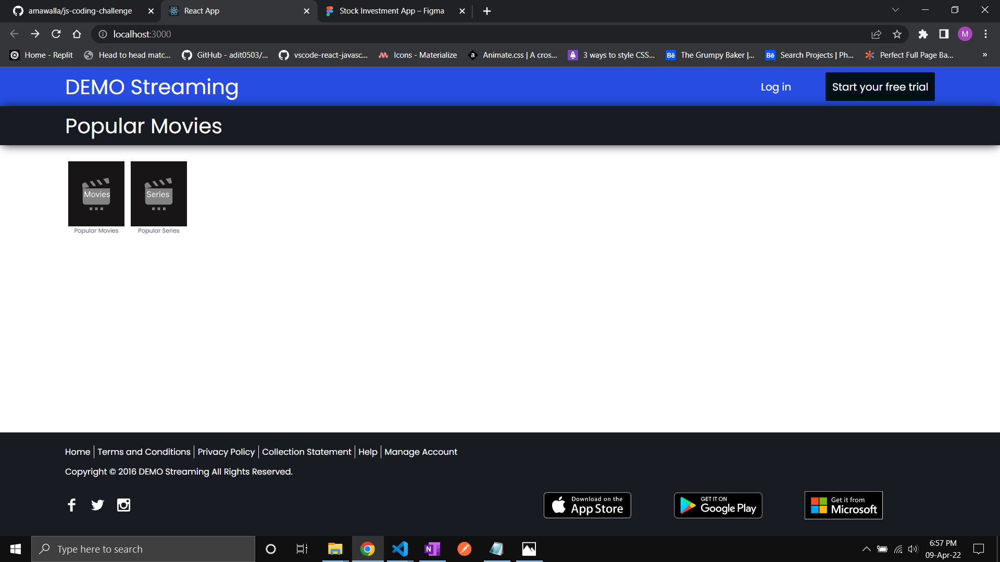
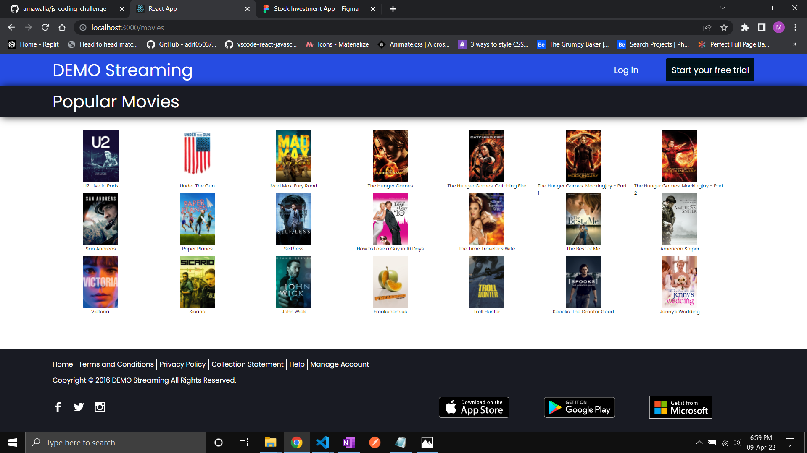

# Ellipsis Challenge

This project is built with React 18 and the libraries used are react router dom, json server for fetching data from the given json file which I had to twitch and remove the total from it and concurently which for my case is installed globally to run the server and the react app together. From the challenge instructions the app has to begin from an index.html page but for React its alittle different where this app begins from the index.js page to App.js page where I defined the routes for the app I could have done it without and just used the states and checked if it was clicked but I thought this was a better way of doing things. Also had to design the the movies and series placeholders using figma that made it easier to use after importing the design as an svg file. Plus Instead of the folder being named dist I named the folder src as the convection used for most react apps

### How I came to this design

- Breakdown the components, knew I will only make use of 3 pages Home, Movies and Series page.

- Made the 3 components Header, Footer and Content and called them for all 3 pages.

- Needed the router dom for switching between pages if movies link was clicked then navigate to the movies page.

- Made use of the json server filter and pagination feature to help filter the date to the right amount.

### Imporvements

- I would add a filter for the genres and add some anime.
- Would add a card with the cast of the movies selected and basically show more details including the ratings.
- Would filter depending on the most popular first.

### What I would do differently

- Would make the pages have better resposiveness.
- Would take users input on the type of genres they like and start filtering from that.
- Would write better tests.

# Screenshots

### Home screen

### Movies screen

